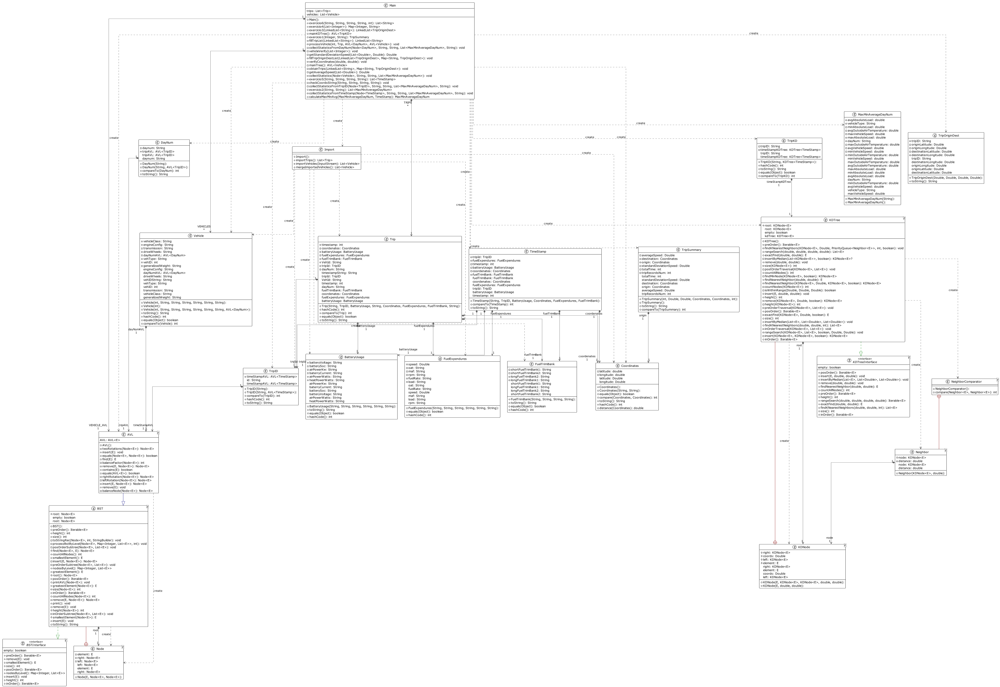

# Projeto 2 da Unidade Curricular de esinf 2023/2024 #

# Comandos do Maven #


### Compilar ###

```bash
mvn clean package
```
### executar os testes (com coverage) ###

```bash

mvn clean verify

```

# 1. Elementos do grupo ###


| Número de estudante | Nome            |
|---------------------|-----------------|
| **1221694**         | João Pinto      |
| **1220612**         | José Sá         | 
| **1211883**         | Mariana Correia |          
| **1201804**         | Rafael Araújo   |
| **1221700**         | Vasco Sousa     |


# 2. Distribuição de tarefas ###


| Tarefas     | João Pinto | Rafael Araújo | Vasco Sousa | José Sá | Mariana Correia |
|-------------|------------|---------------|-------------|---------|-----------------|
| Exercício 1 |   **✓**    |     **✓**     |    **✓**   | **✓**  |     **✓**       |
| Exercício 2 |            |               |             |         |      **✓**      |
| Exercício 3 |            |               |             |  **✓**  |                 |
| Exercício 4 |   **✓**    |               |             |         |                 |
| Exercício 5 |            |     **✓**     |             |         |                 |
| Exercício 6 |            |               |     **✓**   |         |                 |

# 3. Diagrama de Classes ###

